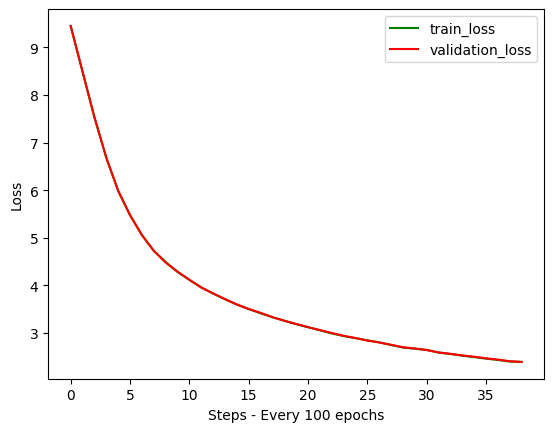

# 🧠 Building Small Language Models (SLMs) from Scratch in PyTorch

This repo demonstrates how to **build, train, and use a Small Language Model (SLM)** completely from scratch using PyTorch.  
The project is inspired by architectures like **GPT-2**, but scaled down so you can train and experiment on a single GPU (or even CPU for small configs).




---

## 📂 Project Structure
├── dataset.py # Handles TinyStories dataset + GPT-style tokenization

├── model.py # Implements GPT architecture (attention, blocks, embeddings)

├── train.py # Training loop with warmup + cosine annealing scheduler

├── infer.py # Inference / text generation script

├── requirements.txt

└── README.md # This file


---

## 🚀 Features
- **From-scratch GPT implementation**  
  - Multi-Head Causal Attention  
  - Transformer Blocks with RMSNorm  
  - FeedForward MLP  
  - Token & Positional Embeddings
  - Weight tying & initialization
  
- **Training pipeline**  
  - [TinyStories dataset](https://huggingface.co/datasets/roneneldan/TinyStories) (HuggingFace)  
  - Sliding window dataset loader  
  - Mixed precision training (AMP + GradScaler)  
  - LR warmup + cosine annealing  
  - Gradient clipping & weight decay
    
- **Inference & Generation**  
  - Greedy decoding (deterministic)  
  - [Optional] Top-k sampling for creativity
 
- **Visualization**: Training vs validation loss plots  

---

## 📊 Model Config (default)
```python
GPT_CONFIG_124M = {
    "vocab_size": 50257, # the vocabulary size
    "context_length": 128, # seq. len
    "emb_dim": 384, # d_model
    "n_heads": 6, # no of attention heads
    "n_layers": 6, # no of transformer layers
    "drop_rate": 0.1, # dropout rate
    "qkv_bias": False # whether to have biases for query, key, value in multi-head-attention blocks
}

```


## 📦 Installation

```bash
git clone https://github.com/ayushWeb07/miniGPT.git
cd <repo-name>
pip install -r requirements.txt
```

## 📚 Dataset

We use the roneneldan/TinyStories
 dataset, a synthetic dataset of short stories written in simple language, specifically tailored for 4-5 year old kids.

---

## 📚 Usage
### 1️⃣ Prepare Dataset

`python dataset.py`

- Downloads **TinyStories** dataset from HuggingFace.
    
- Saves everything into a local `.txt` file.
    

### 2️⃣ Train the Model

`python train.py`

- Runs the training loop with **warmup + cosine scheduler**.
    
- Automatically saves best model weights (`best_model_params.pth`).
    
- Plots train vs validation losses.

### 3️⃣ Run Inference

`python inference.py`

- Initializes a tokenizer from tiktoken

- Creates an input sample: Once upon a time there was a pumpkin.

- Does `language modeling` on the above mentioned sample text

```bash
Text (before generation): Once upon a time there was a pumpkin.
Text (after generation): Once upon a time there was a pumpkin. The pumpkin loved to...
```

---

## 📚 Resources Used

This project was inspired and guided by the following resources:

- [Karpathy's Let's reproduce GPT-2](https://youtu.be/l8pRSuU81PU)

- [The Illustrated Transformer](https://jalammar.github.io/illustrated-transformer/)

- [Build SLM from scratch](https://youtu.be/pOFcwcwtv3k)


